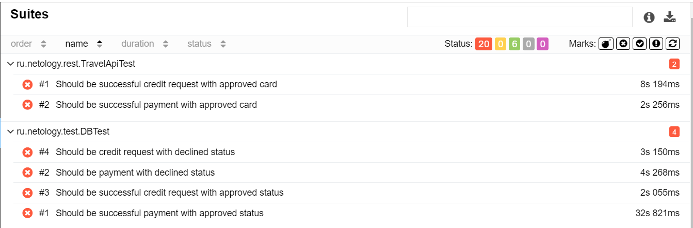
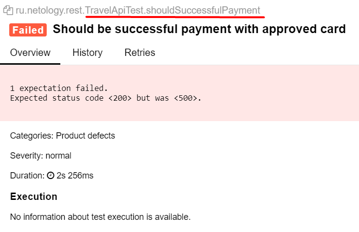

### Итоги автоматизированного тестирования
#### Краткое описание
Автоматизированы запланированные (_Plan.md_) позитивные и негативные сценарии покупки тура.

Разработаны тесты:
* UI-тесты - _class TravelTest_;
* API-тесты -   _class DBTest_, _class TravelApiTest_;
* по результатам прогона тестов получены репорты Allure.
#### Общее количество тест-кейсов: 26.
* _TravelTest_ - 20,
* _DBTest_ - 4,
* _TravelApiTest_ - 2.
#### Процент успешных и не успешных тест-кейсов: 23% успешных, 77% неуспешных.
* _TravelTest_ - 30% успешных, 70% - неуспешных,
* _DBTest_ - 100% неуспешных,
* _TravelApiTest_ - 100% неуспешных.

Репорты Allure:
  
  
  

#### Bag-репорты: открыты 5 issues.
* [В поле "Владелец" можно ввести цифры, любые знаки, буквы не латинского алфавита в неограниченном количестве #1](https://github.com/KomarovaN/QA50-diplom/issues/1),
* [В поле "Месяц" можно ввести значение больше 12 #2](https://github.com/KomarovaN/QA50-diplom/issues/2),
* [В ответ на запрос POST симулятору сервисов банка, отправленному с валидными данными, возвращается код ошибки сервера 500 #3](https://github.com/KomarovaN/QA50-diplom/issues/3),
* [В базе данных нет записей о статусе оплаты после получения ответа от симулятора сервисов банка #4](https://github.com/KomarovaN/QA50-diplom/issues/4),
* [Если поля "Месяц" и "Номер карты" пустые, то выводится сообщение "Неверный формат" вместо сообщения "Поле обязательно для заполнения" #5](https://github.com/KomarovaN/QA50-diplom/issues/5).

#### Общие рекомендации.
Тесты приложения (_class TravelTest_) с проверкой отображения сообщений банка о результатах выпонения операции:
* shouldPayCardValidApproved(),
* shouldNotPayCardValidApproved(),
* shouldCreditCardValidApproved(),
* shouldNotCreditCardValidApproved(),
* shouldPayCardValidDeclined(),
* shouldNotPayCardValidDeclined(),
* shouldCreditCardValidDeclined(),
* shouldNotCreditCardValidDeclined();

а также все тесты с запросами к БД (_class DBTest_) для проверки внесенных приложением данных
о том, успешно ли был совершён платёж и каким способом,
необходимо повторить после устранения ошибки запроса к симулятору сервисов банка с кодом 500,
то есть когда симулятор сервисов банка вернет код выполнения запроса 200,
и API-тесты (_class TravelApiTest_) пройдут успешно.

